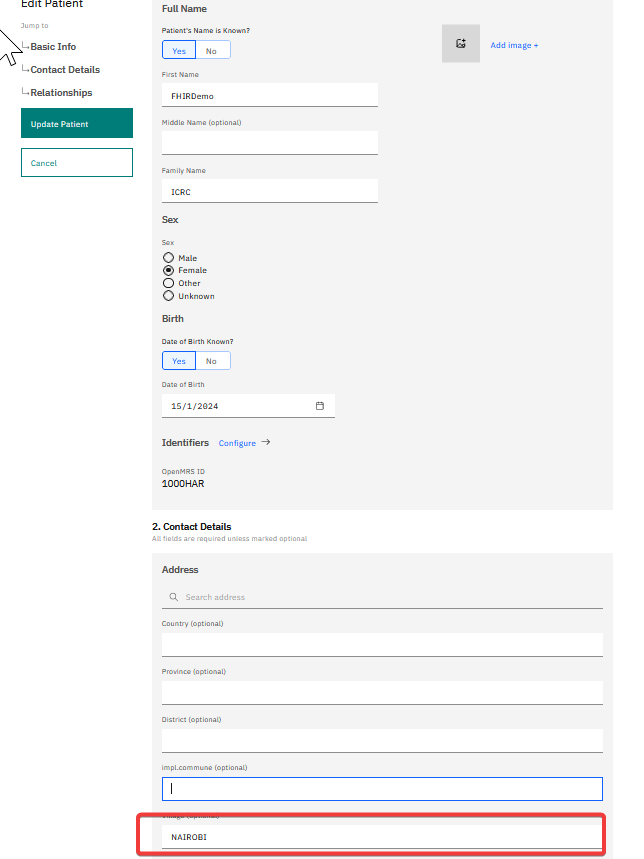
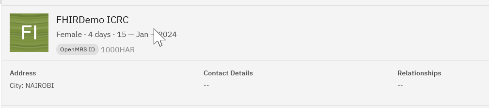
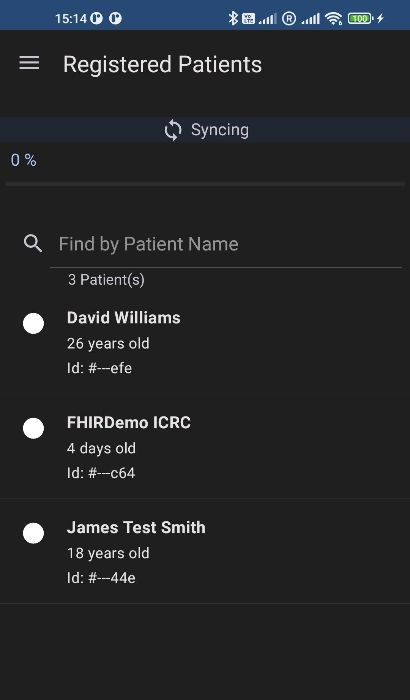
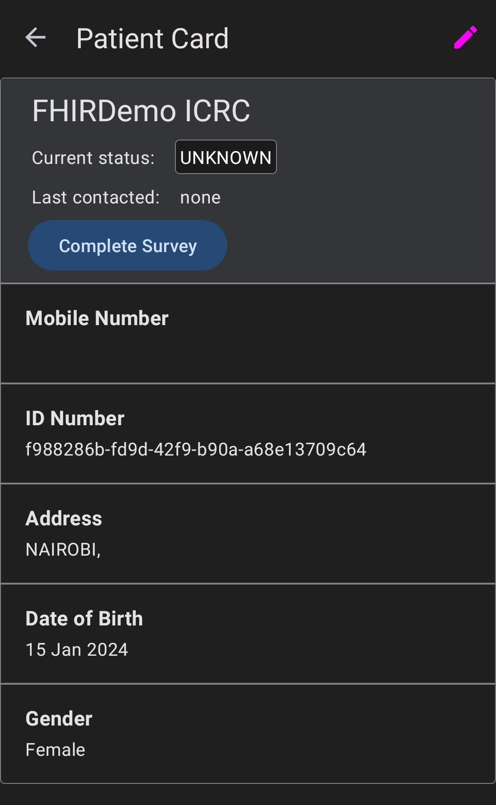

# Modifications Done

Some small code modifications have been done to:
- be able to compile the project ( JDK compatibility issues)
- use OpenMRS dev3 server. See `com.google.android.fhir.demo.FhirApplication.onCreate`. the default password has been hardcoded as it's publicly available on OpenMRS Community Doc.


# How to start the application

Start demo with your preferred IDE ( Intellij, Android Studio). No issue there ( as  compilation issues have been solved).

# Demo

## TimestampBasedDownloadWorkManagerImpl
we changed to
```kotlin
private val urls =
    LinkedList(
      listOf(
        "Patient?_sort=_lastUpdated",
        "Observation?_sort=_lastUpdated"
        )
    )
```

## Nairobi
By default, only patients with a City address `NAIROBI` will be displayed. 
It's hardcoded in the official demo in code `com.google.android.fhir.testing.TestDownloadManagerImpl`


## Add user on OpenMRS

Create some patients on https://dev3.openmrs.org with the city NAIROBI:



For instance, the user `FHIRDemo ICRC` has been created: 



## Find this user on the mobile App

on the mobile app, click on "Sync", to see all patients with city address `NAIROBI`


Click on the demo patient to check data are synchronized:



## Editing a patient Details

Synchro is not working currently.

